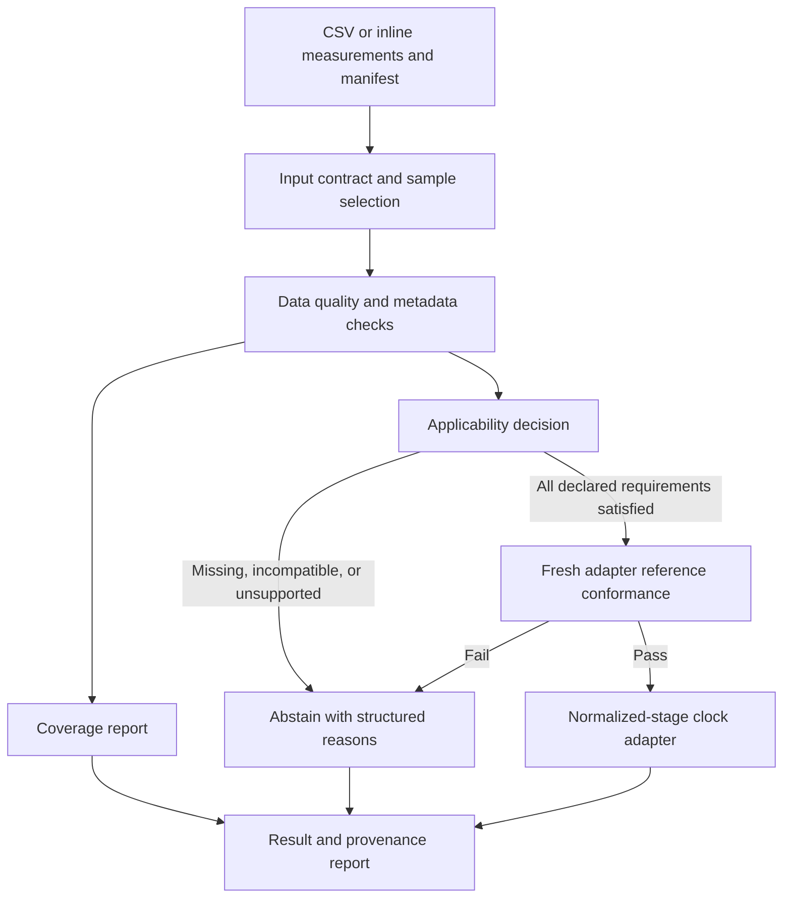

# Aging Clock Conformance

An open validation toolkit for determining whether biological data satisfies an
aging clock's documented requirements and whether clock implementations reproduce
trusted reference results.

**Python 3.11+ · Local and offline · Versioned scientific evidence · Optional MCP**

```text
Data present
    ≠ Data valid for a clock
    ≠ Implementation conforms to reference
    ≠ Clock externally validated for this population
    ≠ Clinically validated
```

```sh
python -m pip install '.[mcp]'
aging-clock list
aging-clock conformance run horvath-2013
```

Install from a clone of this repository; no PyPI release is implied. The core alone
is installed with `python -m pip install .`. All reference assets needed for the
initial score profile ship with the package. Nothing downloads at runtime.

## Why this exists

A dataset with 350 of 353 expected CpGs is incomplete. Even all 353 values cannot
establish how a sample was normalized, whether its platform and tissue fit the
method, whether a missing-value policy was followed, or whether the implementation
applied the correct transformation. The toolkit makes these questions inspectable
before allowing a calculation. It never supplies a global "95% is valid" rule.

Researchers get provenance and explicit scientific scope. Engineers get typed
contracts, stable findings, deterministic computations, and a tested CLI. Agent
developers get the same decisions through local, structured MCP tools.

## What is implemented

| Capability | Behavior |
| --- | --- |
| Clock registry | Versioned, source-backed JSON definitions and generated JSON Schemas |
| Input contract | Long or feature-by-sample CSV, explicit selection, JSON/YAML manifests |
| Validation | Duplicate/conflicting IDs, nulls, malformed values, NaN/infinity, beta range, units, quality flags, and metadata gaps |
| Applicability | Structured abstention or conditional computation; independent from coverage |
| Coverage | Present, usable, missing, invalid, and extra features, with full JSON lists |
| Conformance | Fresh recomputation against checksummed, independently generated R outputs |
| Comparison | Two executed arithmetic paths, each checked against the same frozen R reference |
| Provenance | Source URLs, licenses, checksums, versions, implementation digest, Git state, runtime, timestamp |
| Reports | Typed JSON envelopes, content-derived run IDs, optional Markdown |
| Agent access | Ten read-only MCP tools; inline data only, with no sample-scoring tool |



The package keeps scientific behavior in adapters. The CLI and MCP server call
the shared application API. See [architecture](docs/architecture.md).

## Supported clock and precise scope

| Clock | Modality | Executable stage | Reference evidence | Implementations |
| --- | --- | --- | --- | --- |
| Horvath 2013 multi-tissue | DNA methylation | Complete, already normalized 353-CpG beta values → DNAm age | 16 public publisher tutorial samples; exact recorded R scores/ages; published rounded ages | `python-fsum`, `python-decimal` |

Both implementations pass `score-v1` on the bundled fixture. The independent
expected values were produced upstream using R 4.5.2 / RPMM 1.25 / cluster 2.1.8.1.
The Decimal path uses separate arithmetic and transformation code; it is not an
independent biological model or independent normalization pipeline.

This release does **not** execute IDAT processing, BMIQ normalization, imputation,
EPIC remapping, or other clocks. The accepted tissue vocabulary is a documented
subset of the publication. Acceptance of metadata for other listed tissues or
450K arrays does not extend the 27K-derived occipital-cortex fixture evidence.

## Quick start

Run these commands from the repository root after installation:

```sh
aging-clock registry validate
aging-clock show horvath-2013
aging-clock conformance run horvath-2013
aging-clock compare --clock horvath-2013
aging-clock provenance horvath-2013 --json
```

Real output from the bundled reference suite:

```text
Clock: Horvath 2013 multi-tissue DNA methylation age
Implementation: python-fsum
Profile: score-v1 (normalized beta scoring)
Samples: 16; passed: 16; failed: 0
Tolerance: score 1e-12; result 1e-10 years
Status: REFERENCE_CONFORMANT
```

Export one public fixture into a directory you choose, then validate or score it:

```sh
python examples/export_public_fixture.py --output /tmp/acc-public-example
aging-clock validate /tmp/acc-public-example/sample.csv --clock horvath-2013 \
  --manifest /tmp/acc-public-example/sample.json
aging-clock score /tmp/acc-public-example/sample.csv --clock horvath-2013 \
  --manifest /tmp/acc-public-example/sample.json --json
```

The export selects `GSM946048`, whose recorded reference age is
`60.2774909978736` years. The result is a research measurement, not a diagnosis.
The export is a format transformation of a public fixture, not a new reference
expectation. See [quick start](docs/quickstart.md) and [input format](docs/input-format.md).

## Python API

```python
from aging_clock_conformance import Registry, load_fixture, score_sample, validate_sample

clock = Registry.load_default().get("horvath-2013")
sample = load_fixture(clock).cases[0].sample  # bundled public sample
validation = validate_sample(clock=clock, sample=sample)
print(validation.applicability.status)  # CONDITIONALLY_APPLICABLE

report = score_sample(clock=clock, sample=sample)
assert report.result is not None
print(report.result.value)  # approximately 60.2774909978736
print(report.conformance.status)  # REFERENCE_CONFORMANT
```

`validate_sample(clock=clock, sample="sample.csv", manifest="sample.yaml")` accepts
local files too. The full provenance envelope is available through `inspect_sample`.
`score_sample` returns `result: null` when computation is blocked. Direct adapter
calls enforce the same input checks and raise `ComputationBlocked` on rejection.
The public scoring service additionally requires a fresh reference conformance pass.

## What a blocked sample looks like

```sh
aging-clock score examples/incomplete.csv --clock horvath-2013 --json
# exits 1; result is null
```

The report separates observations from decisions, for example:

```json
{
  "code": "ACC_NORMALIZATION_UNKNOWN",
  "severity": "BLOCKING",
  "category": "metadata",
  "message": "Required normalization provenance is unavailable."
}
```

This is an excerpt; complete JSON includes coverage, every finding, applicability,
and provenance. Missing normalization blocks even a complete feature set. An
explicit normalization record with a matching input checksum permits **conditional**
computation: the framework does not independently audit the caller's processing run.

Exit codes: **0** success, **1** scientific abstention or conformance/comparison
failure, **2** malformed input, unknown selection/clock, configuration, or integrity
failure. `coverage` is diagnostic and exits 0 when the report can be generated;
its exit status never authorizes scoring. Global `--quiet`/`--verbose` precede the
command; command-specific `--json` and `--markdown` follow it.

## AI-agent use

```sh
aging-clock-mcp
```

The optional server speaks MCP over local stdio. An agent can discover clocks,
inspect requirements and sources, submit inline measurements for validation,
check applicability and coverage, and run public conformance/comparison tests.
It cannot open arbitrary local biological files or bypass abstention to score a
sample. [MCP setup](docs/mcp.md) covers Codex, Claude Code, and generic clients.

No LLM, provider account, network service, telemetry, or cloud database is required.

## Scientific interpretation and provenance

Passing `score-v1` establishes reproducibility **for these inputs, this pipeline
stage, and these tolerances**. It does not establish normalization quality,
population-specific accuracy, treatment benefit, or clinical utility. Published
validation studies and toolkit conformance are separate evidence. All outputs
carry `research_use_only: true`; population validity is `NOT_ASSESSED` and clinical
validity is `NOT_ESTABLISHED` by this toolkit.

The reference bundle is pinned to
[`horvath_methylation_age@c3d1cfe`](https://github.com/jdj333/horvath_methylation_age/tree/c3d1cfe1beb162add6ce8c1a1c21606f89c8a64a).
Only an explicit allowlist of public artifacts is imported. No personal biological
sample or private derived database is included. The canonical model uses the
publisher's `CoefficientTraining` column, unchanged intercept, and tutorial inverse
transformation. See [source research](docs/research-decisions.md),
[provenance](docs/provenance.md), and [conformance](docs/conformance.md).

## Development and adding clocks

```sh
python3 -m venv .venv
. .venv/bin/activate
python -m pip install --require-hashes -r requirements/dev.lock
python -m pip install --no-deps --no-build-isolation -e .
ruff check .
ruff format --check .
mypy src
pytest
python scripts/generate_schemas.py --check
python scripts/check_artifacts.py
aging-clock registry validate
aging-clock conformance run horvath-2013
aging-clock compare --clock horvath-2013
python scripts/check_build.py
```

CI runs the same checks on Python 3.11, 3.12, 3.13, and 3.14 without secrets or
proprietary data. It verifies deterministic schemas and artifacts, builds twice,
and exercises the installed wheel outside the source tree. See
[development](docs/development.md), [contribution guidelines](CONTRIBUTING.md),
[adding a clock](docs/adding-a-clock.md), and [agent guidance](AGENTS.md).

## License and citation

Project software and documentation: [MIT](LICENSE). Publisher scientific artifacts
and their numerical derivatives retain **CC BY 2.0**, with author and transformation
attribution in [NOTICE.md](NOTICE.md). Upstream project-written reference code keeps
its MIT attribution. See [licensing](docs/licensing.md) and [CITATION.cff](CITATION.cff).

Cite Steve Horvath, *DNA methylation age of human tissues and cell types*, Genome
Biology (2013), [doi:10.1186/gb-2013-14-10-r115](https://doi.org/10.1186/gb-2013-14-10-r115),
and the exact toolkit and fixture versions used. The
[2015 correction](https://doi.org/10.1186/s13059-015-0649-6) is included in the source
record; corrected cancer findings must not be confused with predictor conformance.
